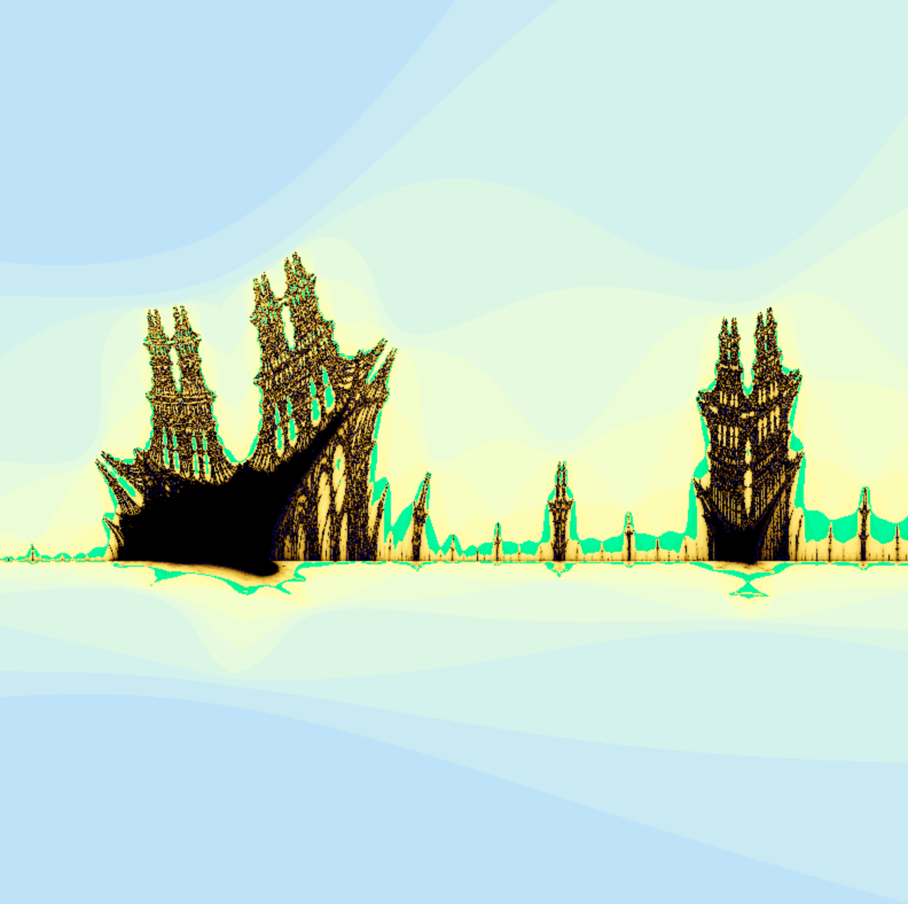

# Fractol Project
## Description
Fractol is a 42 school Project aimed at exploring fractals; mathematical sets that exhibit a repeating pattern displayed at every scale.
## Features
- *Switch between fractls* : Mandelbrot | Julia | Tricorn | Burning_ship | Mandbat
- Increase and decrease max iteration for shape calculation.
- Zoom and unzoom.
- Different colors patterns.
## Installation
```
$> make
$> ./fractol [Mandelbrot | Julia | Tricorn | Burning_ship | Mandbat]
```
## Screenshots

###### Demo 1:


###### Demo 2:


###### Demo 3:


## Contact me

Feel free to email me (eloiriaglichaimae2@gmail.com) about any bugs or anything you find wrong in the code.
